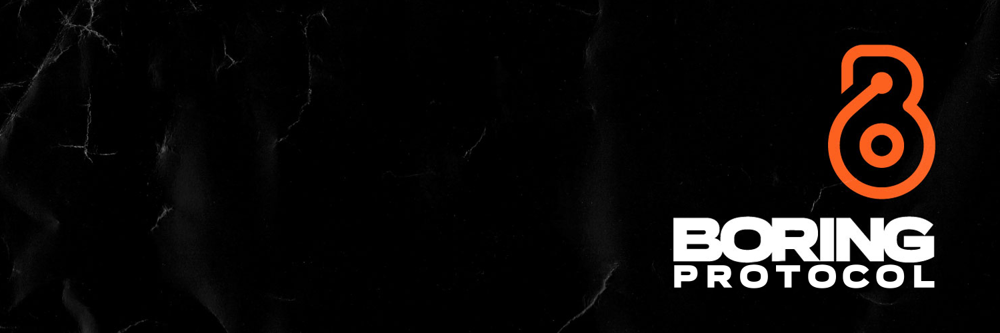

## Mission Statement

Boring Protocol is a customer-owned, decentralized, encrypted, and environmentally friendly dVPN. Our unique hybrid of web3 technologies, coupled with geographically distributed peer-to-peer hardware-based network nodes, can earn rewards for our network operators (Boperators). Our unique focus on privacy advocacy and education, paired with network encryption and the Solana blockchain, combine to facilitate the organic growth expected of a low cost borderless ubiquitous censorship-resistant communication network designed to benefit everyone on Earth.

## What is Boring Protocol?

Boring Protocol is a Web3-powered decentralized VPN, <i>or dVPN</i> built on the Solana Blockchain, allowing users to pay with BOP, the network's native token, by the Gb rather than a subscription membership. Boring Protocol utilizes the privacy of web3-based authentication and payments with BOP token incentives for node operators designed to organically grow Boring's global people-built network, and provides a peer-to-peer bandwidth market to conduct transactions between node providers and bandwidth users.

## Where can I buy BOP tokens?

Go to CoinMarketCap and search for Boring Protocol and tap on the button labeled “Market” near the price chart. In this view, you will see a complete list of exchanges that carry the BOP token.
BOP has a max supply of 250,000,000. If you would like to buy/swap BOP at the current rate use [Jupiter aggregator](https://jup.ag/swap/SOL-BOP), [Raydium](https://raydium.io/), or [ORCA](https://www.orca.so/).

## What is a MotherBored?

- A MotherBored is the name for Boring nodes used to provide dVPN access.
- Available now!: [Motherbored is in stock and ready to ship - visit our store!](https://store.motherbored.limited/products/boring-protocol-mbv2)
